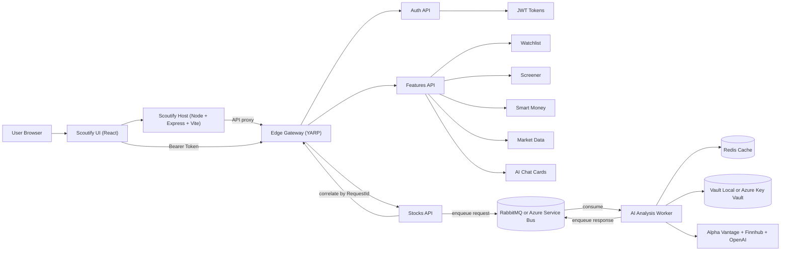
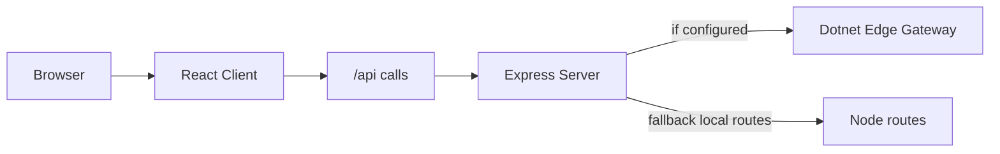
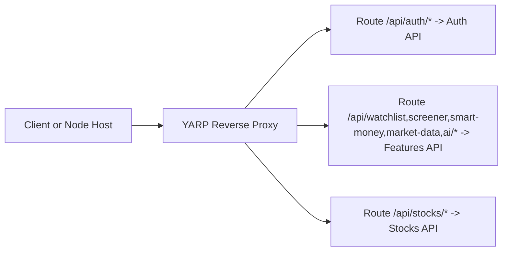
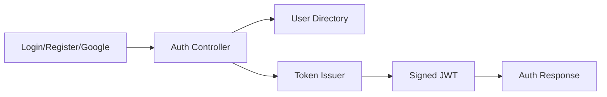
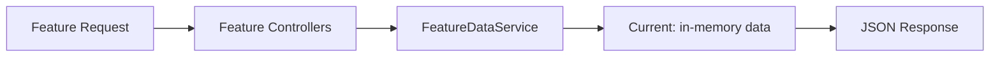
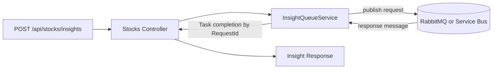
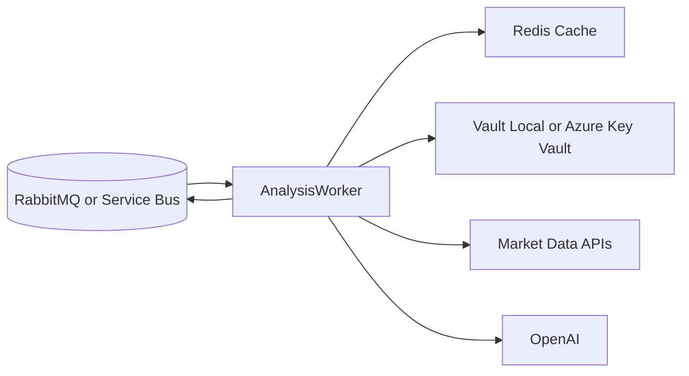
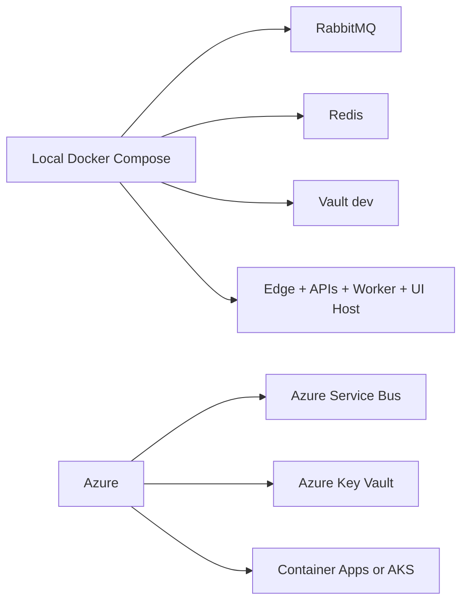

# ScoutifyApps Architecture

This document gives:
- A platform-level architecture view across all repositories
- A component-level architecture section for each major service

## Platform Architecture (High Level)

## Component Architecture

### 1) `scoutify` (UI + Node Host)

- React handles pages and user interactions.
- Express hosts the app and can proxy all API traffic to .NET edge.
- JWT token is sent by client with API requests.

### 2) `scoutify-edge-gateway` (YARP)

- Central entry point for all backend APIs.
- Keeps client routing simple and backend services decoupled.

### 3) `scoutify-auth-api`

- Handles local and Google auth.
- Issues JWT used by all protected APIs.

### 4) `scoutify-features-api`

- Powers watchlist, screener, smart money, market data, and AI chat/cards.
- Uses async service layer; easy to replace data source with DB/external services.

### 5) `scoutify-core-api` (Stocks API)

- Async request/response orchestration for heavy stock insight generation.
- Correlation ID (`RequestId`) matches response to original request.

### 6) `scoutify-ai-analysis-service` (Worker)

- Consumes stock analysis jobs asynchronously.
- Applies caching and secret retrieval.
- Calls market data + LLM providers and publishes final response.

### 7) `scoutify-deployment` (Infra)

- Local desktop stack mirrors production communication pattern.
- Azure replaces local infra with managed equivalents.

## End-to-End Data Flow (Feature + AI)

1. User logs in through `Auth API` and gets a JWT.
2. User hits feature endpoints via edge gateway; `Features API` responds directly.
3. For deep AI insights, `Stocks API` enqueues request to message bus.
4. Worker processes request using cache, secrets, and external providers.
5. Worker publishes correlated response; `Stocks API` returns final insight to UI.
